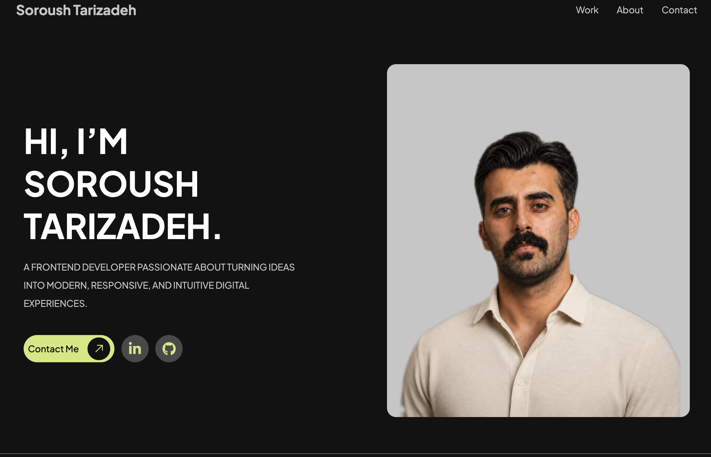
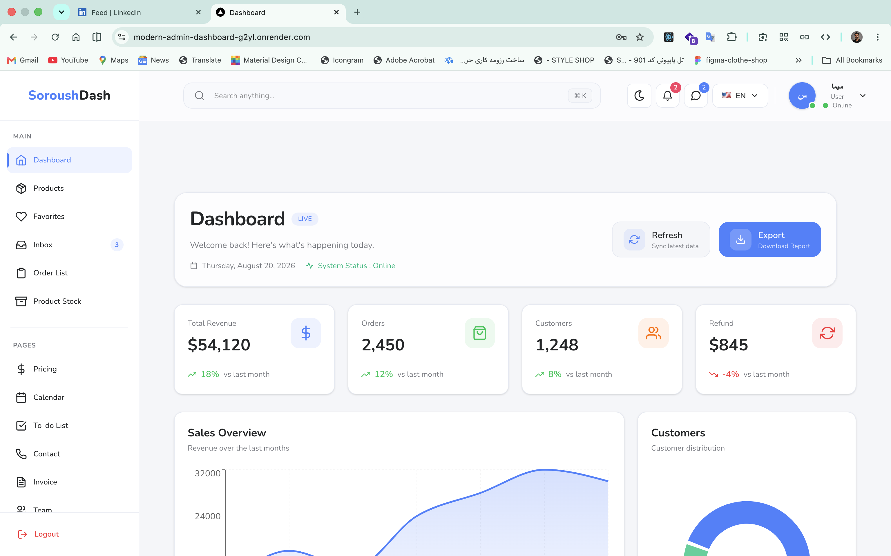
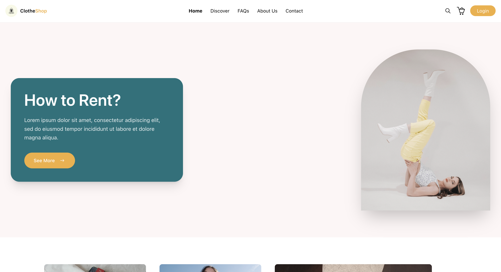

# Soroush Tarizadeh — Portfolio

> A modern personal portfolio website built to showcase my work, frontend development skills, selected projects, and experience.

[](https://soroush-portfolio.onrender.com/)



## Overview

This is my personal portfolio website, designed and developed to present my work as a Frontend Developer.

The project focuses on clean UI, responsive layouts, reusable React components, and a straightforward user experience. It includes selected projects, an introduction to my capabilities and experience, a resume link, social profiles, and a functional contact form with server-side email delivery.

The application is built with the Next.js App Router and TypeScript, with Tailwind CSS used for styling and responsive design.

## Features

* Responsive portfolio layout for desktop, tablet, and mobile
* Hero section with personal introduction and social links
* Featured projects with live demos and GitHub repositories
* Project image preview with fullscreen viewing
* About section with capabilities and development experience
* Resume download
* Responsive mobile navigation
* Functional contact form
* Loading, success, and error states for form submission
* Server-side email delivery with Resend
* Custom 404 page
* SEO-friendly metadata
* Open Graph and Twitter metadata
* Optimized images with Next.js Image
* Custom typography with Plus Jakarta Sans
* Custom design system built with Tailwind CSS

## Tech Stack

### Core

* **Next.js 16.3.1**
* **React 19.2.8**
* **TypeScript 5**
* **Tailwind CSS 4**

### Supporting Tools

* **React Icons** — UI and social icons
* **Resend** — Contact form email delivery
* **ESLint** — Code quality and linting
* **Next/Image** — Image optimization

## Featured Projects

### DashStack

A modern admin dashboard built with Next.js and Tailwind CSS, focused on creating a clean, responsive, and reusable interface for managing dashboard data.



* **Year:** 2026
* **Role:** Frontend Developer
* **Live Demo:** https://modern-admin-dashboard-g2yl.onrender.com/
* **Repository:** https://github.com/SoroushTarizade/modern-admin-dashboard

### Modern Clothes Shop

A modern and responsive e-commerce web application built with Next.js and React, featuring product browsing, authentication, search, category filtering, and shopping cart management.



* **Year:** 2025
* **Role:** Frontend Developer
* **Live Demo:** https://clotheshop.onrender.com/
* **Repository:** https://github.com/SoroushTarizade/clotheshop

## Contact & Email Integration

The portfolio includes a functional contact form connected to a Next.js Route Handler.

```text
Contact Form
     ↓
POST /api/contact
     ↓
Next.js Route Handler
     ↓
Resend API
     ↓
Email Delivery
```

The API performs required-field validation and handles successful and failed email delivery with appropriate HTTP responses.

The Resend API key is stored as an environment variable and is never exposed in the client-side application.

## Project Structure

```text
portfolio/
├── app/
│   ├── about/
│   │   └── page.tsx
│   ├── api/
│   │   └── contact/
│   │       └── route.ts
│   ├── globals.css
│   ├── layout.tsx
│   ├── not-found.tsx
│   └── page.tsx
│
├── components/
│   ├── about/
│   │   ├── About.tsx
│   │   ├── AboutPreview.tsx
│   │   ├── Capabilities.tsx
│   │   └── Experience.tsx
│   ├── contact/
│   │   └── Contact.tsx
│   ├── header/
│   │   └── Header.tsx
│   ├── hero/
│   │   └── Hero.tsx
│   └── projects/
│       ├── FeaturedProjects.tsx
│       └── ProjectCard.tsx
│
├── public/
│   ├── fonts/
│   └── images/
│
├── asset/
│   └── screenshot/
│
├── next.config.ts
├── package.json
├── postcss.config.mjs
├── tsconfig.json
└── README.md
```

## Getting Started

### Prerequisites

Make sure you have Node.js and npm installed.

### Installation

Clone the repository:

```bash
git clone <YOUR-PORTFOLIO-REPOSITORY-URL>
cd portfolio
```

Install the dependencies:

```bash
npm install
```

### Environment Variables

Create a `.env.local` file in the project root:

```env
RESEND_API_KEY=your_resend_api_key
```

Replace `your_resend_api_key` with your Resend API key.

> Never commit `.env.local` or expose your API key in client-side code.

### Run the Development Server

```bash
npm run dev
```

Open http://localhost:3000 in your browser.

## Available Scripts

| Command         | Description                           |
| --------------- | ------------------------------------- |
| `npm run dev`   | Starts the development server         |
| `npm run build` | Creates an optimized production build |
| `npm run start` | Starts the production server          |
| `npm run lint`  | Runs ESLint                           |

## Design & UI

The portfolio uses a custom visual system built on top of Tailwind CSS.

Key design characteristics include:

* Dark background with high-contrast typography
* Lime accent color
* Responsive spacing and typography
* Consistent rounded UI elements
* Interactive hover states
* Smooth scrolling
* Responsive navigation
* Project image preview interactions

The primary typeface is **Plus Jakarta Sans**, loaded through Next.js font optimization.

## SEO & Metadata

The application includes metadata configuration for:

* Page title and description
* Keywords
* Author information
* Open Graph
* Twitter Cards
* Search engine indexing
* Site icons

This helps improve how the portfolio is presented in search engines and when shared across social platforms.

## Deployment

The portfolio is deployed and publicly available at:

**https://soroush-portfolio.onrender.com/**

The production application runs as a Next.js application, with server-side configuration such as the Resend API key provided through environment variables.

## Development Focus

While building this portfolio, I focused on:

* Building reusable React components
* Creating responsive layouts
* Working with the Next.js App Router
* Using TypeScript for type-safe development
* Designing clean and maintainable UI
* Handling client-side form interactions
* Building server-side API routes
* Integrating third-party services
* Optimizing images and typography
* Following production-oriented development workflows

## Author

**Soroush Tarizadeh**

Frontend Developer focused on building modern, responsive, and user-friendly web experiences.

* **Portfolio:** https://soroush-portfolio.onrender.com/
* **GitHub:** https://github.com/SoroushTarizade
* **LinkedIn:** https://www.linkedin.com/in/soroush-tarizadeh/

---

If you have a project idea, opportunity, or just want to connect, feel free to reach out through the portfolio.
